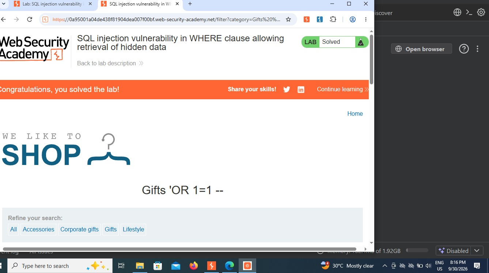
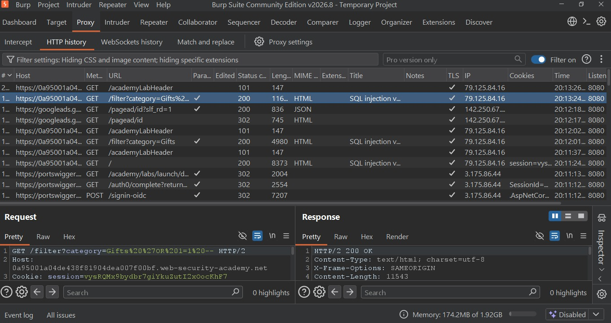

Lab 01: SQL Injection Vulnerability Allowing Retrieval of Hidden Data

Lab Link:PortSwigger Web Security Academy  
Difficulty:Apprentice  
Status:Solved ✅  
Date:30-Sep-2026  
Tool Used:Burp Suite Community Edition

1. Vulnerability Summary
The e-commerce shop application had a SQL Injection vulnerability in the `category` filter parameter. By manipulating the parameter, it was possible to bypass the `released = 1` condition and retrieve hidden/unreleased products.

2. Root Cause
Backend query was using direct string concatenation:
`SELECT _ FROM products WHERE category = '[USER_INPUT]' AND released = 1`
No prepared statements were used.

3. Payload Used
`Gifts' OR 1=1 --`

*Why it works:*
- `'` closes the original single quote
- `OR 1=1` makes the condition always true
- `--` comments out the rest of the query (`AND released = 1`)

Final Query becomes:
`SELECT _ FROM products WHERE category = 'Gifts' OR 1=1 --' AND released = 1`

4. Steps to Reproduce
1. Open Burp Suite, set Proxy to Intercept OFF
2. Open the lab shop and click on Gifts category
3. Go to Burp -> HTTP History -> Find `/filter?category=Gifts`
4. Send request to Repeater
5. Change parameter to `Gifts' OR 1=1 --`
6. Send request -> All products are displayed -> Lab Solved!

5. Proof of Concept

*Lab Solved Evidence:*

*Burp Suite Repeater Evidence:*

6. Impact
- Disclosure of sensitive and hidden data
- Can lead to authentication bypass
- Can lead to full database dump via UNION-based attacks

7. Mitigation
- Use Parameterized Queries (Prepared Statements)
- Implement strict input validation and whitelisting
- Use least privilege principle for database users
- Implement WAF and proper error handling (generic errors only)

---
Tools:Burp Suite Community Edition, Chromium Browser
