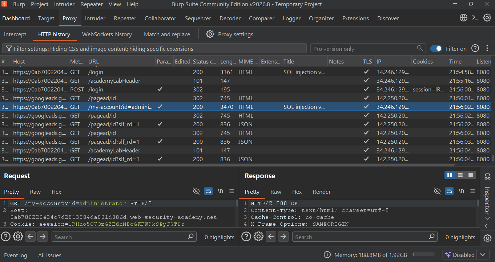
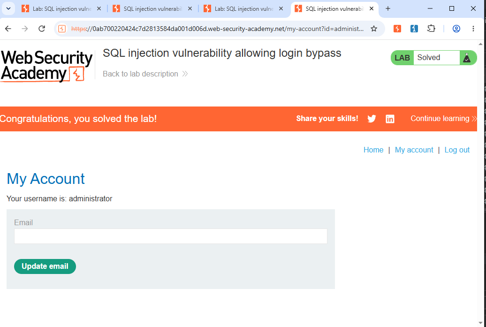

# Lab 02: SQL Injection - Login Bypass

## Lab Description
This lab contains a SQL injection vulnerability in the login functionality. The application fails to properly sanitize user input in the login form.

## Objective
To bypass authentication and login as the administrator without knowing the password.

## Vulnerability
Login page vulnerable to SQL injection at username field. The backend query concatenates user input directly.

## Payload Used

## Steps to Reproduce
1. Navigate to the lab and go to /login
2. Enable Burp Suite Intercept
3. Enter payload `administrator'--` in Username field
4. Enter any random password (e.g., 123)
5. Forward the request to server
6. You will be logged in as administrator user
7. Lab will show as solved

## Impact
- Authentication bypass
- Unauthorized administrator access
- Complete compromise of application

## Mitigation
- Use parameterized queries / prepared statements
- Use ORM with proper escaping
- Implement input validation and least privilege
- Avoid string concatenation in SQL queries

## Evidence
**Burp Suite Request with SQLi Payload:**

**Successful Admin Login - Lab Solved:**

## Tools Used
- Burp Suite Professional
- PortSwigger Web Security Academy

## Lab Link
https://portswigger.net/web-security/sql-injection/lab-login-bypass
