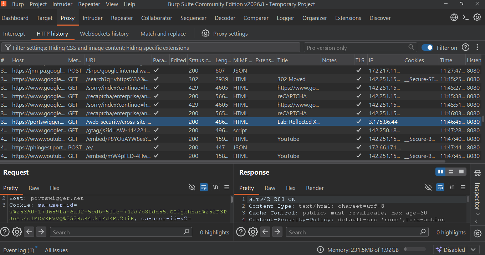
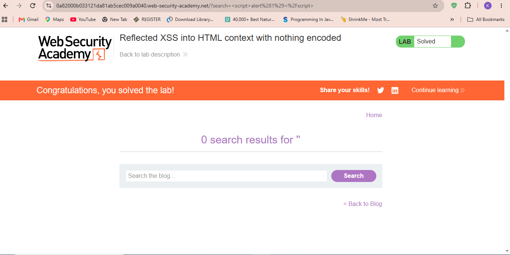
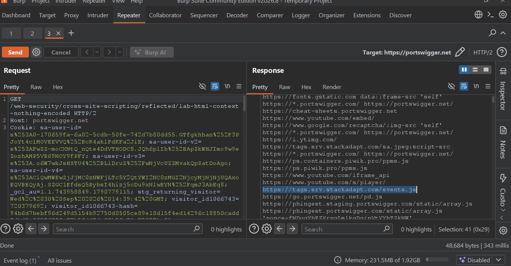

# Lab 03 - Reflected XSS into HTML context with nothing encoded

**Platform:** PortSwigger Web Security Academy  
**Vulnerability:** Cross-Site Scripting (XSS) - Reflected  
**Severity:** High  

### Description
The application reflects user input from the search parameter directly into the HTML response without any encoding.

### Steps to Reproduce
1. Accessed the lab
2. Navigated to `/?search=test`
3. Tested payload ``
4. Injected payload in search parameter
5. Alert executed and lab solved

### Payload Used

### Evidence

**Status: Solved** 

