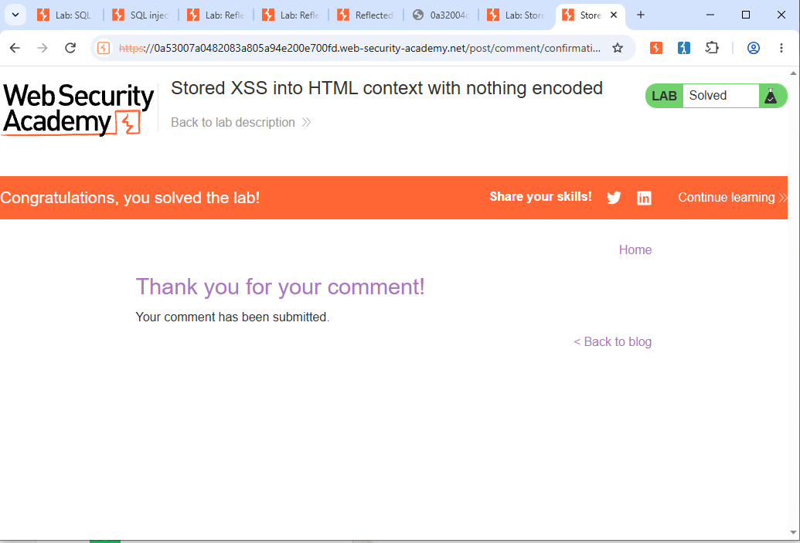

# Lab04 - Stored XSS into HTML context with nothing encoded

## Objective
Exploit Stored XSS vulnerability where comment is stored without encoding.

## Lab Link
PortSwigger - Stored XSS into HTML context with nothing encoded

## Steps to Exploit
1. Opened any blog post
2. Went to comment section
3. Entered payload in Comment field: ``
4. Filled Name and Email
5. Clicked Post Comment
6. Clicked Back to Blog and reopened post
7. Alert triggered and lab solved

## Payload Used

## Proof of Concept

### 1. Lab Solved

### 2. Alert Popup

## Impact
Attacker can steal user cookies and hijack sessions.

## Mitigation
- HTML Encode output
- Sanitize user input
- Implement CSP
