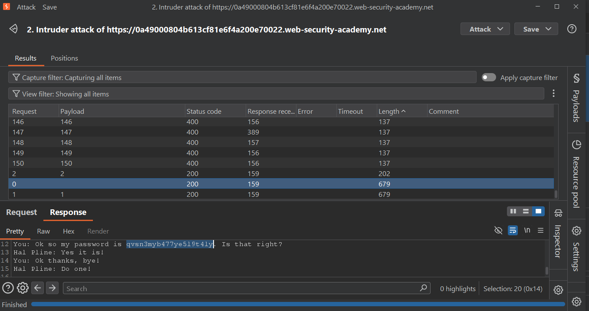
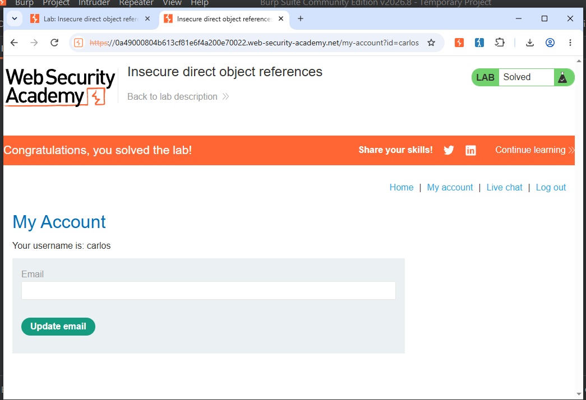

# Lab05 - IDOR - Insecure Direct Object Reference

**Lab Link:** PortSwigger - IDOR with static files

### Vulnerability:
IDOR in `/download-transcript/{id}.txt`

### Attack Flow:
1. Intercepted `GET /download-transcript/1.txt`
2. Tested for IDOR by changing ID to 0,2,3...
3. Used Burp Intruder (0-20)
4. Found sensitive transcript at `0.txt` containing password

**Password Found:** `qvsn3myb477ye519t41y`

### Evidence:
- `IDOR-Password.png` - Shows password in transcript
- `IDORSolved.png` - Lab solved

### Impact: Account Takeover via IDOR
### Fix: Implement proper access control check - Verify user owns the file before serving it.
### Proof:

#### Password Found:

#### Lab Solved:

