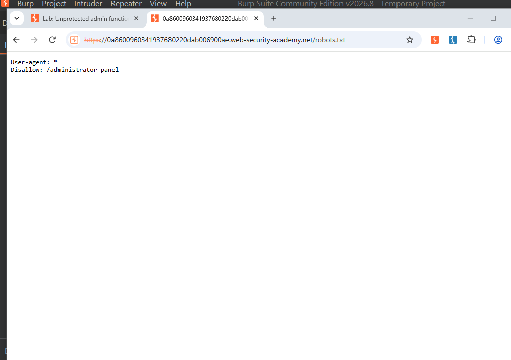
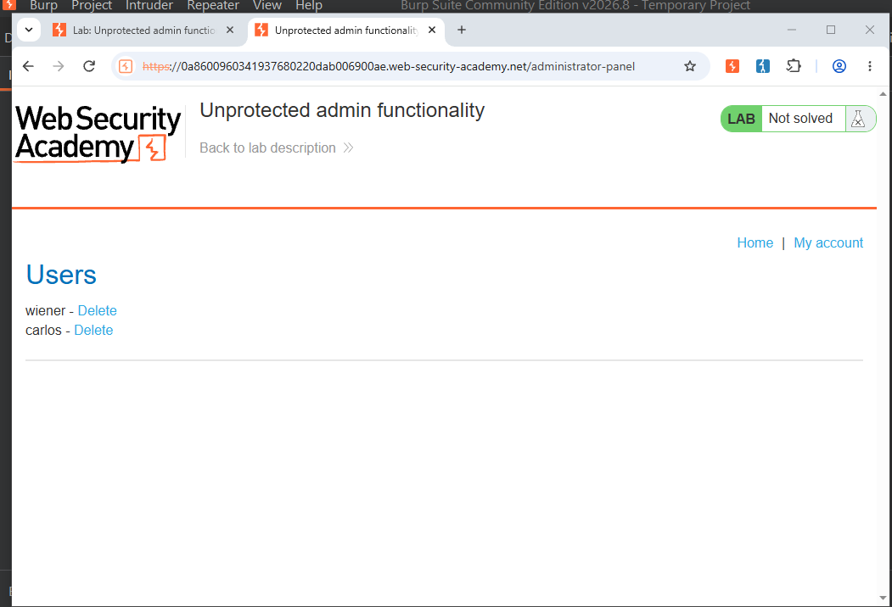
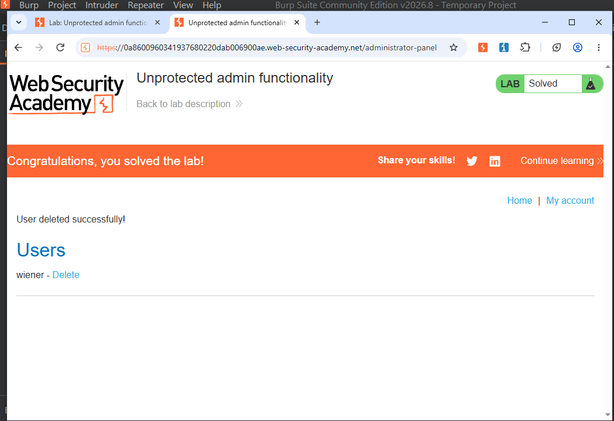

# Lab06 - Broken Access Control - Unprotected Admin Functionality

## Bug: Admin panel /administrator-panel has no authentication check

### How I Found:
1. Checked /robots.txt -> Found Disallow: /administrator-panel
2. Directly accessed /administrator-panel -> Opened without login!
3. Deleted user carlos -> Lab Solved

### Impact: Attacker can access admin panel and delete any user/data

### Proof:

### Fix: Add login check + Role-based access control for admin paths
