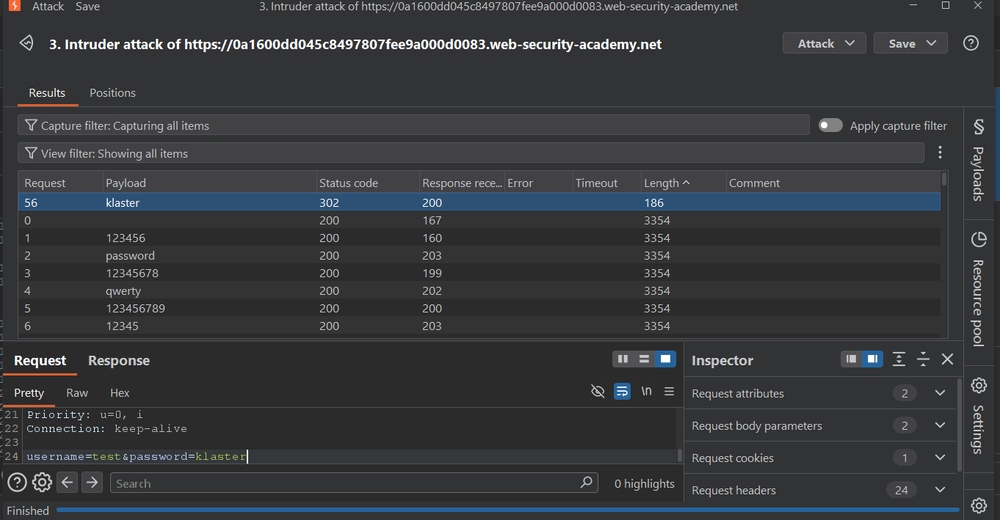
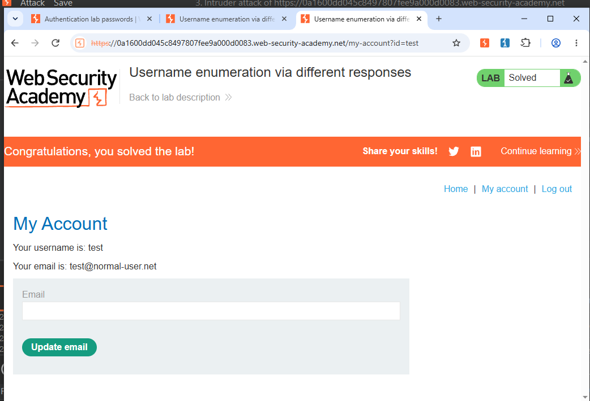

# Lab 07: Username Enumeration via Different Responses

**Lab Link:** PortSwigger Academy - Authentication Lab 07  
**Difficulty:** Apprentice  
**Status:** Solved ✅  
**Date:** 03-Oct-2026

### 1. Vulnerability Summary
The application leaks information about valid usernames through different response lengths/messages. This allows an attacker to enumerate valid usernames and then brute-force the password.

### 2. Root Cause
- Application returns different error messages for invalid username vs invalid password.
- Response length varies for valid vs invalid users.
- No rate limiting or account lockout protection.

### 3. Payloads Used

**For Username Enumeration:**
- Position: `username=§test§`
- Payload: Candidate usernames list (provided by lab)
- Identification: Sort by Length - The one with different Length is the valid user.

**For Password Brute-force:**
- Position: `password=§test§`
- Username: Valid username found in previous step
- Payload: Candidate passwords list (123456, password, qwerty...)
- Identification: Different Length / 302 status = Correct password.

### 4. Steps to Reproduce
1. Turn Burp Proxy ON, Intercept OFF.
2. Try login with test:test.
3. In Burp > HTTP History > Find POST /login > Send to Intruder.
4. Intruder > Positions > Clear § > Add § only for username value.
5. Payloads > Paste candidate usernames > Start Attack > Sort by Length to find valid username.
6. Go back to Positions > Fix username as valid user, add § to password field.
7. Payloads > Paste candidate passwords > Start Attack > Find correct password via Length.
8. Login with found credentials to solve the lab.

### 5. Proof of Concept

**Username Enumeration:**

**Password Brute-force:**

**Lab Solved:**

### 6. Impact
- Account Takeover (ATO)
- Username disclosure
- Enables brute-force and credential stuffing attacks

### 7. Mitigation
- Return generic error message: "Invalid username or password" for both cases.
- Ensure response length and time are consistent.
- Implement rate limiting, account lockout, and CAPTCHA after failed attempts.
- Implement 2FA / MFA.

---
**Tools:** Burp Suite Community Edition, Intruder, Chromium
